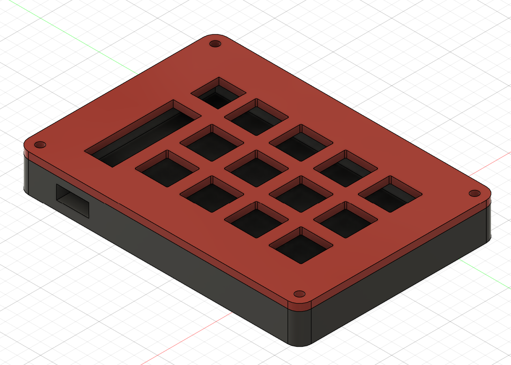

# Daedapad

Daedapad is a macropad with 12 mechanical switches, 9 LEDS, a rotary encoder, and a 128x32 OLED display.  

 (Model of the casing I made in Autodesk Fusion, I have not got the hardware yet so I cannot upload a picture of that)

This is my first attempt at anything like this, so I am using this as a fun learning experience!

* Keyboard Maintainer: [Nathan LC](https://github.com/Nauticos)

Features of Daedapad:

SEEED XIAO RP2040 (microcontroller)
12 mechanical keyboard switches arranged in a 3x4 pattern
9 SK6812MINI LEDS
1 EC11 rotary encoder
1 128x32 OLED screen
Sandwich Mounting Style Case
QMK Firmware

Make example for this keyboard (after setting up your build environment):

    make daedapad:default

Flashing example for this keyboard:

    make daedapad:default:flash

See the [build environment setup](https://docs.qmk.fm/#/getting_started_build_tools) and the [make instructions](https://docs.qmk.fm/#/getting_started_make_guide) for more information. Brand new to QMK? Start with our [Complete Newbs Guide](https://docs.qmk.fm/#/newbs).
