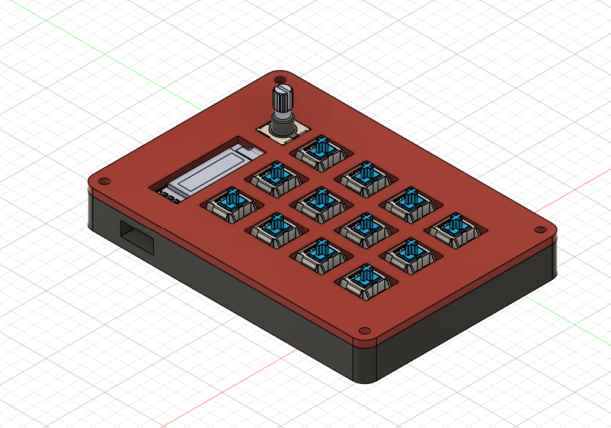
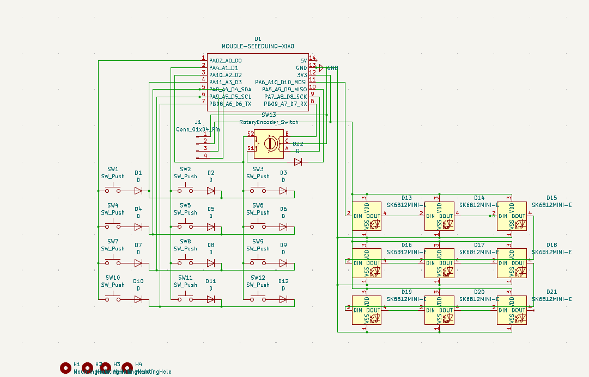

# Daedapad

**Daedapad** is a macropad with 12 mechanical switches, 9 LEDs, a rotary encoder, and a 128x32 OLED display.

* Keyboard Maintainer: [Nathan LC](https://github.com/Nauticos)

**<ins>Features of Daedapad:</ins>**

* SEEED XIAO RP2040 (microcontroller)
* 12x MX-style switches arranged in a 3x4 pattern
* 9x SK6812MINI LEDs
* 1x EC11 rotary encoder
* 1x 128x32 OLED screen
* VIA compatability
* A custom sandwich mounting style case
* QMK Firmware

**<ins>BOM (Bill of Materials):</ins>**

* 1x SEEED XIAO RP2040 (microcontroller)
* 12x MX-style switches
* 12x Blank DSA keycaps
* 13x 1N4148 through-hole diodes
* 9x SK6812MINI LEDs
* 1x EC11 rotary encoder
* 1x 128x32 OLED screen
* 1x Custom sandwich mounting style case
* 1x Custom PCB
* 4x M3×16mm screws
* 4x M3×5×4mm heatset inserts

 This is a model of the casing I made in Autodesk Fusion, I have not got the hardware yet so I cannot upload a picture of that.

 Here is a screenshot of my schematic, I made it using KiCad.

 

Here is a screenshot of my PCB design, I made it using KiCad. You can access a demo of this at https://kicanvas.org/?repo=https%3A%2F%2Fgithub.com%2FNauticos%2FDaedapad%2Fblob%2Fmain%2FPCB%2Fhackpad.kicad_pcb.