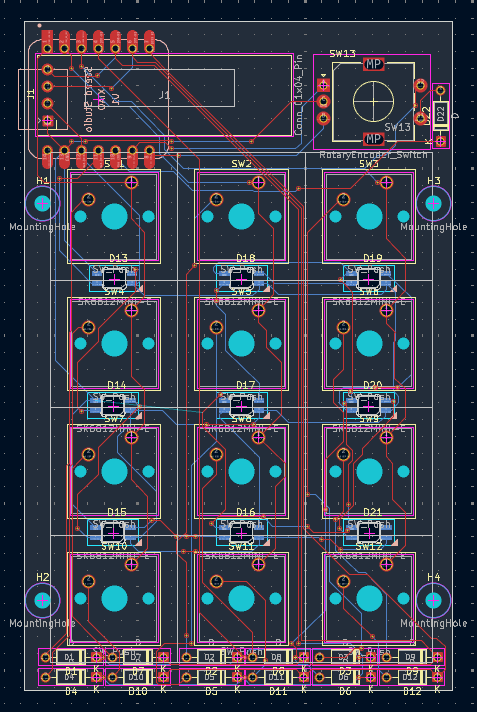

# Daedapad

Daedapad is a macropad with 12 mechanical switches, 9 LEDS, a rotary encoder, and a 128x32 OLED display.  

* Keyboard Maintainer: [Nathan LC](https://github.com/Nauticos)

Features of Daedapad:

* SEEED XIAO RP2040 (microcontroller)
* 12 MX-style switches arranged in a 3x4 pattern
* 9 SK6812MINI LEDS
* 1 EC11 rotary encoder
* 1 128x32 OLED screen
* VIA compatability
* Sandwich Mounting Style Case
* QMK Firmware

BOM (Bill of Materials):

* SEEED XIAO RP2040 (microcontroller)
* 12 MX-style switches
* 12 Blank DSA keycaps
* 13 1N4148 through-hole diodes
* 9 SK6812MINI LEDS
* 1 EC11 rotary encoder
* 1 128x32 OLED screen
* Custom Sandwich Mounting Style Case
* Custom PCB
* 4 M3×16mm screws
* 4 M3×5×4mm heatset inserts
* 4 2.5x10mm screws (had these on hand)
* Solder

 (This is a model of the casing I made in Autodesk Fusion, I have not got the hardware yet so I cannot upload a picture of that)

 Here is a screenshot of my schematic, I made it using KiCad.

 Here is a screenshot of my PCB design, I made it using KiCad. You can access a demo of this at https://kicanvas.org/?repo=https%3A%2F%2Fgithub.com%2FNauticos%2FDaedapad%2Fblob%2Fmain%2Fhackpad.kicad_pcb.

This is my first attempt at anything like this, so I am using this as a fun learning experience!